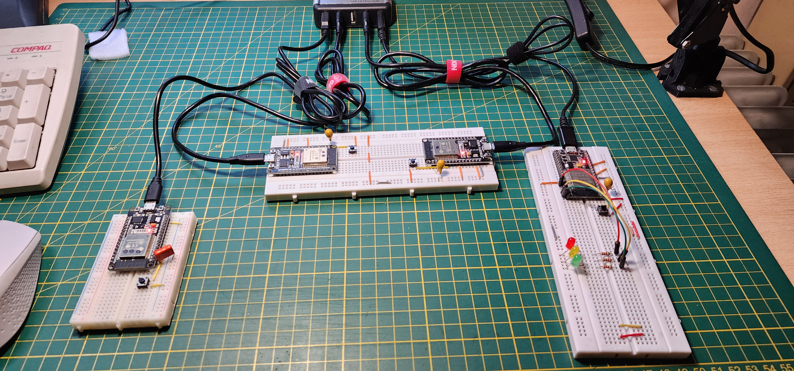
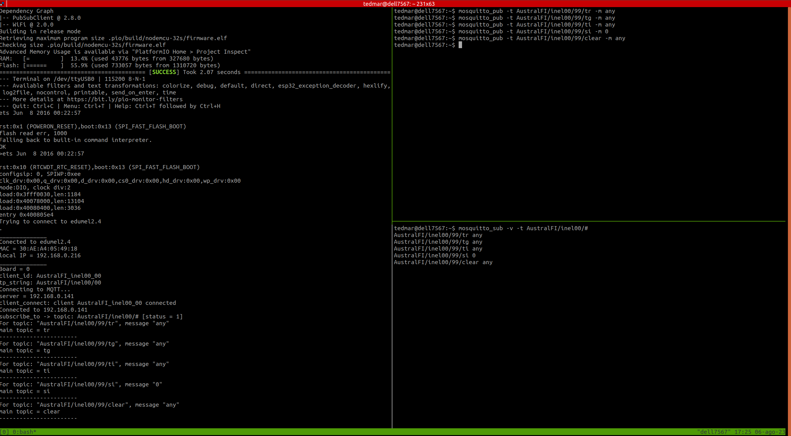

#       Proyecto 41-mqtt_00

 Austral 2023 - Informatica Electronica - Austral
 EAMartinez

El objetivo de este proyecto es mostrar como una plaqueta realizada con ESP32 y conteniendo 4 LEDs y un pulsador, puede comunicarse con un _broker_ MQTT de manera de informar la opresión del pulsador y recibir las ordenes de prendido y apagado de los 4 LEDs que posee cada placa. De esta manera, a través del _broker_ se permite que esta placa (y hasta un total 4 placas de esta misma caracteristica) puedan formar parte de un conjunto de IoT donde el _broker_ MQTT es el elemento central de comunicación del flujo a través de todo el sistema 

##      Hardware

 Placa de desarrollo de ESP32
 Pulsador Tact
 3 LEDs externos: 1 rojo, 1 amarillo, 1 verde
 3 Resistores de 220 ohm
 Cables Dupont

##      Conexiones

  Conectar el riel negativo del _protoboard_ (el azul)  dal GND en placa de desarrollo de ESP32.

  Para cada LED externo:  
    * De GND al cátodo del LED
    * Del ánodo del LED al resistor de 220 ohm
    * Del otro extremo del resistor de 220 ohm al GPIO respectivo  

  Conectar a los siguientes GPIOs:  
    * LED rojo a 'LED_RED'  
    * LED amarillo a 'LED_YEL'  
    * LED verde a 'LED_GRN'  

  Desde GPIO 'PUSH' a un extremo del pulsador Tact
  Del otro extremo del pulsador Tact al riel negativo

  Para identifiación de plaqueta usamos dos GPIOs _IB0_ e _IB1_:

  | IB1 | IB0 | board |
  |:---:|:---:|:-----:|
  | GND | GND |  0 |
  | GND |Open |  1 |
  | Open| GND |  2 |
  | Open|Open |  3 |

##      platformio.ini

#####   Definiciones de salidas

  * 1 por cada LED externo  
  * 1 para el LED interno  

#####   Definiciones de entrada

  * 1 para el pulsador Tact
  * 2 bits para la enumeración de plaqueta
    [Nota: la numeración de plaqueta va de 0 a 3: si se deja sin conectar IB0 e IB1, da el número 3]

##### _strings_ de identificación para MQTT:

  En la conversación con el broker MQTT, todos los _strings_ están precedidos por 'MAIN_NAME' el cual es seguido por 'SUB_NAME' que es diferente para cada grupo que se comunique a través del broker.

  Para la identificación inicial en el _broker_ (_broker log_) y para el proceso de suscripción, es continuado por el número de plaqueta o equipo que va de 00 a 99.

  Para publicación de un _tópico_, a los items previamente mencionados se le agrega el _string_ del tópico.

  A continuación, aqui hay ejemplos para el caso de _SUB_NAME_="inel00", _plaqueta_= 00, _tópico_="button":

  **broker log**: _"AustralFI_inel00_00"_
  **publicación tópico**: _"AustralFI/inel00/00/button"_

  En el caso de suscripción, no hay un formato fijo ya que depende de la existencia de _comodines_ de MQTT

##      Estructura del programa

  El programa, que se encuentra en el directorio _src_, está estructurado mediante módulos de C de compilación separada, con lo cual posee una estructura jerárquica claramente establecida:

####    main.cpp

  En efecto, el programa principal está realizado en el archivo _main.cpp_ que, como se puede observar tiene una estructura muy sencilla; siendo el programa principal, todas las acciones que realiza están vinculadas a tres objetivos claramente definidos:

  * El acceso a la conexión WiFi.   (_wifi_ruts.h_)
  * El manejo del hardware propio de la plaqueta, que básicamente son 4 LEDs y un pulsador (_hw.h_)
  * La comunicación con el _broker_ MQTT (_mqtt.h_)

  Por ello se incluyen los archivos _.h_ que se mencionan.

  Existen solo dos funciones en dicho programa principal:

  * _setup_: permite la inicialización de los módulos que depende de este programa
  * _loop_: Se realizan dos acciones: Si se oprimió el pulsador, entonces se publica la novedad al _broker_ y, de cualquier manera, se verifica si se recibió alguna novedad del _broker_ mediante _test_mqtt_.

####    Manejo de WiFi

  Aparte del archivo de encabezamiento _wifi_ruts.h_ que posee los prototipos de las funciones de manejo de WiFi, se encontaráel archivo _wifi_ruts.cpp_ que justamente tiene la implementación de dichos prototipos.
  También existe un archivo de configuración _wifi_data.h_ donde se pueden colocar la identificación y la clave para el acceso de hasta tres lugares que sean usuales en el trabajo de desarrollo del grupo; cual de esos lugares en definitiva se conectará en el momento de ejecución, depende del símbolo _WIFI_ que se encuentra definido en _plaformio.ini_.

####    Manejo de hardware de la plaqueta

  Como se mostró anteriormente, el archivo donde están los prototipos de las funciones utilizadas por _main.cpp_ de manejo del hardware es _hw.h_; sin embargo, no todo el manejo de _hardware_ está declarado en este archivo, ya que solo está el que necesita el programa principal; específicamente, el manejo de los LEDs, que forma parte de la entrada desde el _broker_, se encuentran los prototipos en el archivo _hw_actions.h_.

  Obviamente, la implementación de las funciones se encuentran en _hw.cpp_ y en _hw_actions.cpp_, respectivamente

####    Manejo de la comunicación con el _broker_ MQTT

  Los nombres de los archivos vinculados a este ítem  comienzan con _mqtt_, de los cuales pueden destacarse los siguientes:

  _mqtt.cpp_: implementa las funciones principales cuyos prototipos están en _mqtt.h_, archivo que, a su vez, fué incluído dentro de _main.cpp_ como ya se explico más arriba.
  Las tres funciones públicas que implementa este archivo son las llamadas desde _main.cpp_

  Utilizando este archivo, se van a recibir las novedades del _broker_ a que se han suscripto y estas novedades, en este caso particular, sirven para cambiar el estado de los 4 LEDs; por lo tanto, esas acciones se realizarán mediante funciones cuyos prototipos están definidos en _mqtt_actions.h_ y que están implementadas en _mqtt_actions.cpp_

  Se dispone de un archivo adicional referido a _mqtt_ cual es _mqtt_def.h_: este archivo, incluído en _mqtt.cpp_, es particularmente importante, ya que sirve para hacer configuraciones en relación con el _broker_.

##      Configuración del proyecto

  El proyecto se configura mendiante tres elementos:

#### Configuración de _harwdare_
  Este proyecto permite tener hasta 4 plaquetas con el mismo programa intercomunicadas en la nube IoT; para ello, y para que su función en IoT sea diferenciada de sus hermanas, es necesario identificarlas, por lo cual se dispone de dos bits con las que se las puede numerar de 0 a 3, como se dijo previamente; para ello, ver como conectar esos dos bits bajo el subtítulo _Conexiones_.

#### Configuración mediante el archivo _mqtt_def.h_

  **C1 -> List of topics and actions**: En este arreglo de estructuras, se encuentran los pares formados por _tópico_ y _acción_ que se pueden ofrecer para suscribirse en el _broker_. Solo hace falta configurar en este item si se agregan tópicos adicionales.  

  **C2 -> Subscription lists**: aquí aparece la lista de suscripciones que se desea realizar; obsérvese que, para generar el _string_ de suscripción, se comienza con _'MAIN_NAME/'SUB_NAME'/_ y se continúa con el sub-string indicado en cada ítem de esta lista; obviamente, los caracteres reservados **#** y **+** son los consasbidos comodines de MQTT (En caso de duda, ver la función _init_subscriptions_ en el archivo _mqtt.cpp_). Notar que, con la finalidad de poder probar cómodamente otras suscricpiones posibles y comprender como funciona MQTT, se ha pensado preparar hasta 3 juegos de suscripciones que se pueden elegir desde _platformio.ini_ mediante el símbolo _SUB_LIST_.  

  **C3 -> Macros for id strings**: Aqui se usan las definiciones que estan en _platformio.ini_ de los símbolos _MAIN_NAME_, _SUB_NAME_ y, además, el número de placa o equipo en cuestión para generar los _strings_ de identificación para el _broker_, tanto sea para el _log_ en el _broker_, como para la publicación de un tópico o para la suscripción.  

  **C4 -> Broker selection**: También para comprender que el _broker_ MQTT puede estar ubicado en distintos lugares, existen 3 selecciones del _broker_ en particular a usar, la cual se puede seleccionar mediante el símbolo _MQTT_ que se define en _platformio.ini_. Aquí, en realidad, se debe colocar la forma de acceso y validación de cada uno de los 3 _brokers_ a usar.  

#### Configuración mediante _platformio.ini_

  Esta configuración acompaña las anteriores y ya se explicó como influye en la configuración total.

##  Prueba con broker MQTT mosquitto

Para ejemplificar la prueba realizada, se ha usado un broker _mosquitto_ sobre una computadora con Ubuntu 18.04 que se encontraba en la misma red que los microcontroladores ESP32 utilizados.
Las configuraciones son las que se muestran en el código que esta en _github_ tal cual queda después de clonarse.
El único cambio que deberia hacerse es el número de IP del broker _mosquitto_ 

####    Broker mosquitto

Este broker está disponible para ser cargado en cualquiera de los sistemas operativos
Debe cargarse tanto el _broker_ _mosquitto_ asi como _mosquitto-clients_: bajo Ubuntu, se instaló sencillamente con la siguiente línea de comando:

~~~
 $ sudo apt install mosquitto mosquitto-clients
~~~

Normalmente, el solo hecho de cargarlo ya lo hace correr y queda esperando conexiones; obviamente, debe cambiar en el archivo _mqtt_def.h_ la dirección de IP donde se encuentra la máquina donde fue cargado mosquitto y asegurarse que en _platformio.ini_ la configuración MQTT apunta al caso configurado.

####    Placas de hardware

Se han construido 4 placas de hardware con ESP32 una de las cuales posee 3 LEDs (rojo, amarillo, verde); obviamente, las cuatro placas utilizan el led interno de los ESP32 asi como las 4 placas poseen un pulsador; se muestra foto más abajo.

La forma mas rápida de construir una placa única que pueda utilizarse en esta prueba es solamente conectar el pulsador entre el GPIO 'PUSH' y GND (lo cual puede hacerse solamente con dos cables); la identificacion de placa en ese caso sera la 03, ya que los GPIO IB0 e IB1 quedna en sin conexión externa y están con _pull_up_ interno.

Todas las placas, cuando arrancan, se conectan al broker _mosquitto_, leen su número de placa y se suscriben a las novedades como se ve en el archivo _mqtt_def.h_ para el caso de la configuración SUB_LIST = 0 que corresponde que va a recibir las novedades de cualquier origen.

Obviamente, aquellas placas que no tienen LEDs externos no podran mostrar la suscripcion que reciben.

La única información que se publica desde la placa es el cierre del pulsador, que corresponde al tópico _button_.

Se aconseja para probar cada placa, conectarlas sucesivamente a la PC por el cable USB, cargar el programa y poner a correr el monitor serie; una vez que esté corriendo, hacer reset en la plaqueta de ESP32 y observar la información que aparece en la pantalla porque le dará datos valiosos para una eventual busca de problemas. Ver foto más abajo de una captura de pantalla en estas condiciones.

####    Comandos de los clientes de _mosquitto_

Existen dos clientes distintos de _mosquitto_:

* Uno para publicar novedades, que se denomina _mosquitto_pub_
* Uno para suscribirse a novedades, que se denomina _mosquitto_sub_

Para las pruebas conviente tener abiertas dos terminales, una para poder publicar y la otra para poder observar las novedades suscriptas; se aconseja tener abierta una tercera terminal con el monitor serie conectado al ESP32

El comando para publicación sera de este tipo (se muestran todas las publicaciones posibles teniendo en cuenta las suscripciones realizadas en el ESP32); observese que se ha usado para la publicacion un numero de plaqueta o de equipo 99, para indicar que no se trata de ninguna de las placas posibles. Para cada publicación, debe enviarse el comando interactivamente, luego de modificar los argumentos

~~~
mosquitto_pub -t AustralFI/inel00/99/tr -m any        <- tr significa Toggle Red
mosquitto_pub -t AustralFI/inel00/99/ty -m any        <- ty significa Toggle Yellow
mosquitto_pub -t AustralFI/inel00/99/tg -m any        <- tg significa Toggle Green
mosquitto_pub -t AustralFI/inel00/99/ti -m any        <- ti significa Toggle Internal
mosquitto_pub -t AustralFI/inel00/99/sr -m 0          <- sr significa Set Red a 0
mosquitto_pub -t AustralFI/inel00/99/sr -m 1          <- sr significa Set Red a 1
mosquitto_pub -t AustralFI/inel00/99/sy -m 0          <- sy significa Set Yellow a 0
mosquitto_pub -t AustralFI/inel00/99/sy -m 1          <- sy significa Set Yellow a 1
mosquitto_pub -t AustralFI/inel00/99/sg -m 0          <- sg significa Set Green a 0
mosquitto_pub -t AustralFI/inel00/99/sg -m 1          <- sg significa Set Green a 1
mosquitto_pub -t AustralFI/inel00/99/clear -m any     <- clear significa apagar los LEDs
~~~

En el caso del comando de suscripción, debe enviarse y quedará en espera de la llegada de una novedad; se muestra la llegada de algunas novedades, tanto de las placas por la opresión del pulsador, como de las enviadas por _mosquitto_pub_.

~~~
mosquitto_sub -v -t AustralFI/inel00/#

AustralFI/inel00/00/button button
AustralFI/inel00/03/button button
AustralFI/inel00/99/tr 0
AustralFI/inel00/99/tg 0
AustralFI/inel00/99/sy 1
AustralFI/inel00/02/button button
~~~

####    Conexión a WiFi

No olvide cambiar en _mqtt_def.h_ la identificación así como la clave de los puntos de conexión de WiFi donde Ud. desarrolla su actividad (hay hasta tres disponibles) y cambiar concordantemente la definción de cual está usando en _platformio.ini_ mediante el símbolo _WIFI_

##      Fotos

 

 

##  Tutoriales

### MQTT

  [MQTT: The Standard for IoT Messaging - from mqtt.org](https://mqtt.org/)

  [10 Free Public MQTT Brokers(Private & Public)](https://mntolia.com/10-free-public-private-mqtt-brokers-for-testing-prototyping/)

  [mosquitto download](https://mosquitto.org/download/)

###  Node-Red

  [Node-Red Tutorials - From nodered.org](https://nodered.org/docs/tutorials/)

  [Step by step guide to install Node-RED on Ubuntu 18.04 LTS](https://www.techunits.com/topics/setup-guides/step-by-step-guide-to-install-node-red-on-ubuntu-18-04-lts/)

## Videos

###  MQTT

 [Desentrañando MQTT - ¿Cómo funciona?](https://www.youtube.com/watch?v=Tb1t6GKJ0r0)

 [MQTT & ESP32.: (1). Ejemplo sensor de temperatura DHT22](https://www.youtube.com/watch?v=pEv90rO_MD0&list=RDLVx5GML1FqcTQ&index=3)

####  Node-Red

 [Introduction - Node-RED Essentials - From nodered.org](https://www.youtube.com/watch?v=ksGeUD26Mw0)

 [Qué es Node-RED? - Introducción, Node-RED en la Industria, Node-RED e IoT](https://www.youtube.com/watch?v=sl8LzOIvJS0)

